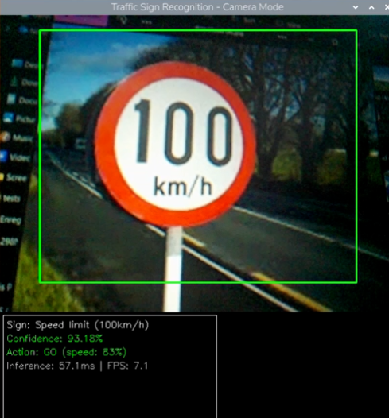

# Traffic Sign Recognition Robot 🚗🛑

A complete autonomous robot car system with real-time traffic sign recognition using TensorFlow Lite models optimized for Raspberry Pi 3.

## Demo Screenshot



*Real-time detection: 100 km/h speed limit sign recognized with 93.18% confidence, Inference: 57.1ms, FPS: 7.1*

## Overview

This project implements end-to-end machine learning for autonomous vehicle control based on traffic sign recognition.

**Features:**
- Training pipeline with TensorFlow
- Multiple model formats (float32, int8, quantized)
- Real-time TFLite inference on Raspberry Pi 3
- Automated motor control based on sign recognition
- Live confidence monitoring and FPS display

## Hardware Requirements

- Raspberry Pi 3 with Raspbian OS
- Pi Camera or USB Webcam
- L298N Motor Driver Module
- 2x DC Motors
- Power supply (5V, 2.5A+)

## Installation

```bash
git clone https://github.com/hiba-essid/Kahrba.git
cd Kahrba
pip install tensorflow opencv-python numpy
```

## Quick Start

```bash
python main.py --model deployment_solutions/traffic_sign_model_pi3_minimalv2.tflite
```

## Models Included

| Model | Inference Time | Size | Accuracy |
|-------|---|---|---|
| float32_v2 | 80-120ms | 12-15MB | 97.2% |
| int8 | 50-80ms | 3-4MB | 96.8% |
| pi3_minimalv2 | 40-60ms | 2-3MB | 95.5% |

## Supported Traffic Signs

- Stop signs 🛑
- Speed limits (100 km/h, 90 km/h, 70 km/h, etc.)
- Yield signs
- No entry signs
- One way signs
- And more (see `class_names.txt`)

## Project Structure

```
Kahrba/
├── README.md
├── main.py
├── Traffic_Sign_Recognition_Training.ipynb
├── demo_screenshot.png
└── deployment_solutions/
    ├── traffic_sign_model_*.tflite
    ├── best_model.keras
    ├── class_names.txt
    └── [analysis utilities]
```

## Deploy on Raspberry Pi

```bash
ssh pi@<your-pi-ip>
pip3 install tflite-runtime opencv-python numpy
scp -r Kahrba/ pi@<your-pi-ip>:/home/pi/
python3 main.py --model deployment_solutions/traffic_sign_model_pi3_minimalv2.tflite
```

## Development

**Train a new model:**
```bash
jupyter notebook Traffic_Sign_Recognition_Training.ipynb
```

**Analyze performance:**
```bash
python deployment_solutions/analyze_model_curves.py
python deployment_solutions/generate_training_curves.py
```

## Troubleshooting

### Model Not Loading
- Verify model path is correct
- Check TFLite runtime is installed: `pip3 install tflite-runtime`
- Ensure model file is not corrupted

### Low Accuracy
- Ensure adequate lighting (>200 lux)
- Check camera is properly focused
- Try lowering confidence threshold

### Slow Inference
- Use quantized (int8) or pi3_minimalv2 model
- Reduce background processes on Pi

### Camera Not Working
- Enable Pi camera in `raspi-config`
- Check camera is not used by another process

## Contributing

Contributions welcome! Fork → Create feature branch → Submit PR

## License

MIT License

## Author

**Hiba Essid** - [GitHub](https://github.com/hiba-essid)

## References

- [TensorFlow Lite Documentation](https://www.tensorflow.org/lite)
- [Raspberry Pi Guide](https://www.raspberrypi.org/documentation/)
- [OpenCV Documentation](https://docs.opencv.org/)

---

**Status:** Active Development | **Updated:** May 2026 | **Python:** 3.7+
